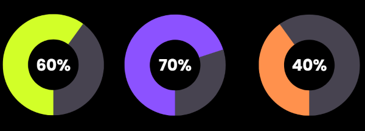

# Anastasiya Aliaksandrova
-----------------------------------
## Contacts
* Telegram @anasttasiaa8
* Email anasttasia238@gmail.com
* Github Ningagoo
-----------------------------------
## About me
My aims are concerned in making things better, learning all the time, gaining experince and new skills.

I like to deal with hard problems in team and help everybody. Also I have creative side which try to make all around more beautiful and can see different excellent matches of colors.

--------------------------------

## Skills
**JS**            **Git**            **Java**


--------------------------------

## Example of code
```javascript
function boolToWord( bool ){
  if (typeof bool == "boolean"){
    if (bool === true) return "Yes";
    else return "No";
  }
}
let bool = true;
console.log(boolToWord( bool ));
```
--------------------------------

## Education
* Belarusian State University of Informatics and Radioelectronics (BSUIR)
* [JavaScript + React](https://www.udemy.com/course/javascript_full/) 
* [JS/FE Pre-school 2023Q2](https://rs.school/js-stage0/)

--------------------------------
## Language
English (B2)
Russian (native)
Belarusian (fluently)